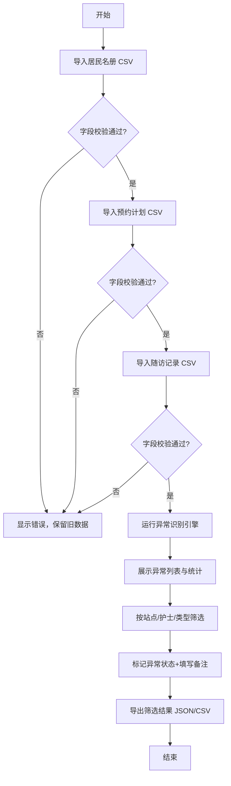

## 1. 产品概述

本地社区慢病随访复核看板，用于社区卫生服务中心对慢病患者随访数据进行质量核查与复核管理。系统通过导入居民名册、预约计划和随访记录三类 CSV 数据，自动识别多种数据异常，并提供异常复核、状态标记、备注记录和数据导出功能，帮助护士和管理人员快速发现并处理随访数据问题。

## 2. 核心功能

### 2.1 功能模块

1. **数据导入模块**: 居民名册 CSV 导入、预约计划 CSV 导入、随访记录 CSV 导入、字段校验、导入错误提示
2. **异常识别引擎**: 逾期未访识别、未预约到访识别、重复随访识别、指标越界识别、居民不在名册识别
3. **异常复核看板**: 多维度筛选（站点、护士、异常类型）、异常列表展示、状态标记（待处理/已确认/忽略/需上门）、备注与处理人记录
4. **数据持久化与导出**: 本地存储持久化、JSON 格式导出、CSV 格式导出、筛选结果同步导出

### 2.2 页面详情

| 页面名称 | 模块名称 | 功能描述 |
|-----------|-------------|---------------------|
| 复核看板主页 | 顶部导航栏 | 系统标题、数据统计概览、导入按钮、导出按钮 |
| 复核看板主页 | 数据导入区 | 三类 CSV 文件上传入口、字段校验结果展示、导入进度与错误提示 |
| 复核看板主页 | 统计概览区 | 异常总数、各类异常数量统计、处理状态统计 |
| 复核看板主页 | 筛选条件区 | 站点下拉筛选、护士下拉筛选、异常类型多选筛选、处理状态筛选 |
| 复核看板主页 | 异常列表区 | 异常条目表格、异常详情展开、状态标记操作、备注编辑、处理人选择 |
| 复核看板主页 | 未登记居民区 | 未在居民名册中登记的随访/预约记录单独列表 |

## 3. 核心流程

用户登录系统后，首先导入三类 CSV 数据文件，系统校验字段合法性后进行数据存储；异常识别引擎自动扫描数据并标记各类异常；用户通过筛选条件定位异常记录，对异常进行状态标记和备注；最后按当前筛选结果导出 JSON 或 CSV 格式的复核报告。

## 4. 用户界面设计

### 4.1 设计风格

- **主色调**: 医疗蓝 (#2563EB) 作为主色，搭配浅蓝背景和深蓝强调色
- **辅助色**: 状态色 - 红色 (#DC2626) 表示严重异常、橙色 (#F59E0B) 表示待处理、绿色 (#059669) 表示已确认、灰色 (#6B7280) 表示忽略
- **按钮风格**: 圆角 8px，主按钮实心填充，次要按钮描边样式，hover 状态有明显颜色过渡
- **字体**: 中文系统字体栈，标题使用中等字重，正文常规字重，数字等宽显示
- **布局风格**: 顶部标题栏 + 左侧筛选面板 + 右侧主内容区的经典后台布局，卡片式组件分区
- **图标**: 使用 lucide-react 图标库，保持线性风格统一

### 4.2 页面设计概述

| 页面名称 | 模块名称 | UI 元素 |
|-----------|-------------|-------------|
| 复核看板主页 | 顶部导航栏 | 深色背景栏、左侧系统名称、右侧数据统计标签、导入/导出操作按钮组 |
| 复核看板主页 | 数据导入区 | 三个并排文件上传卡片、拖拽区域、文件名显示、校验结果状态徽章、错误详情提示 |
| 复核看板主页 | 统计概览区 | 五个彩色统计卡片（总数 + 四类异常）、数字醒目显示、变化趋势微指标 |
| 复核看板主页 | 筛选条件区 | 紧凑的筛选表单、下拉选择器、多选标签、重置按钮 |
| 复核看板主页 | 异常列表区 | 斑马纹数据表格、可展开行详情、状态下拉选择器、备注输入框、操作按钮列、分页器 |
| 复核看板主页 | 未登记居民区 | 独立标签页、警示色边框、居民信息表格 |

### 4.3 响应式

桌面端优先设计，最小支持 1280px 宽度；中等屏幕下筛选面板折叠为顶部横向排列；小屏幕下异常列表转为卡片式堆叠显示。

## 5. 数据安全与校验规则

- 坏日期格式、非数字指标、缺少居民编号的 CSV 文件导入时不得清空旧数据
- 重复导入同一文件通过文件内容哈希值校验，不重复计数
- 所有复核状态、备注、更新时间持久化到 localStorage，页面重启后完全恢复
- 导出内容必须与当前页面筛选条件结果完全一致
