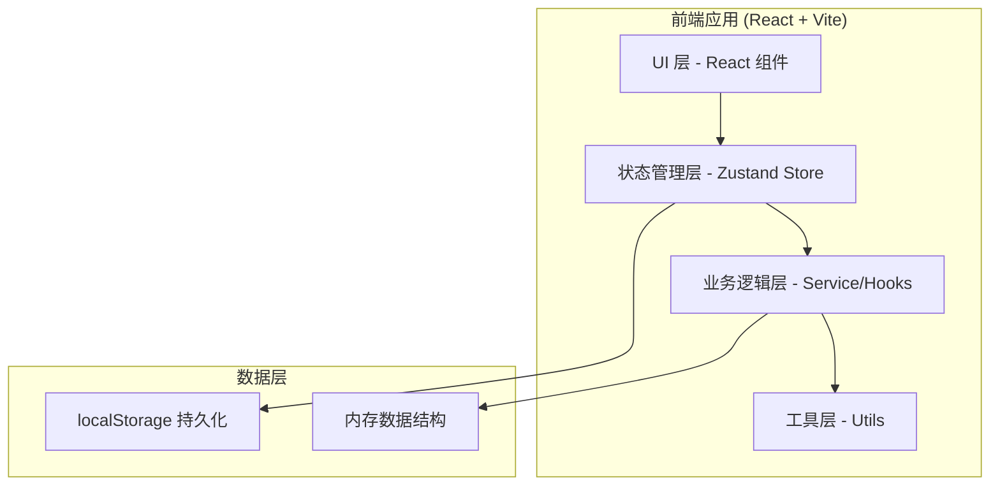
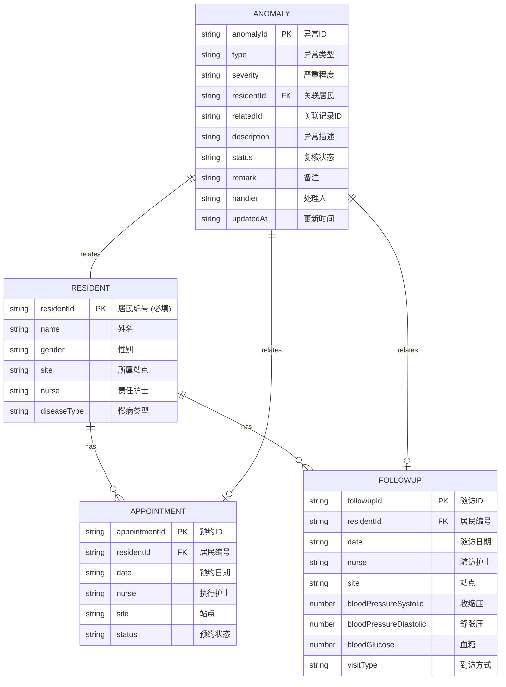

## 1. 架构设计



## 2. 技术描述

- **前端框架**: React 18 + TypeScript
- **构建工具**: Vite
- **样式方案**: Tailwind CSS 3
- **状态管理**: Zustand
- **图标库**: lucide-react
- **数据持久化**: localStorage (浏览器本地存储)
- **后端**: 无后端，纯前端应用

## 3. 技术选型理由

| 技术 | 选型理由 |
|------|----------|
| React 18 + TS | 组件化开发，类型安全，适合复杂表单与数据交互场景 |
| Vite | 快速开发启动，HMR 体验好 |
| Tailwind CSS | 快速构建一致的 UI，无需写额外 CSS 文件 |
| Zustand | 轻量级状态管理，API 简洁，适合中等复杂度应用 |
| localStorage | 纯本地应用，无需后端数据库，数据持久化需求简单 |

## 4. 项目结构

```
src/
├── components/           # UI 组件
│   ├── layout/          # 布局组件 (Header, Sidebar)
│   ├── import/          # 导入相关组件 (FileUpload, ImportResult)
│   ├── dashboard/       # 看板组件 (StatCard, FilterBar, AnomalyTable)
│   └── common/          # 通用组件 (Badge, Button, Modal)
├── hooks/               # 自定义 Hooks
│   ├── useCSVImport.ts  # CSV 导入与解析 Hook
│   ├── useAnomalyDetector.ts  # 异常检测 Hook
│   └── usePersistence.ts # 本地持久化 Hook
├── store/               # Zustand Store
│   └── index.ts         # 全局状态 (数据、筛选、复核状态)
├── utils/               # 工具函数
│   ├── csv.ts           # CSV 解析与生成
│   ├── validator.ts     # 字段校验
│   ├── anomaly.ts       # 异常识别算法
│   ├── hash.ts          # 文件哈希
│   └── export.ts        # 数据导出
├── types/               # TypeScript 类型定义
│   └── index.ts         # 所有业务类型
├── pages/               # 页面
│   └── Dashboard.tsx    # 主看板页面
├── sample-data/         # 样例数据
│   ├── residents.csv    # 居民名册样例
│   ├── appointments.csv # 预约计划样例
│   └── followups.csv    # 随访记录样例
├── App.tsx
├── main.tsx
└── index.css
```

## 5. 数据模型定义

### 5.1 核心数据类型



### 5.2 异常类型枚举

| 异常类型 | 枚举值 | 判定规则 |
|----------|--------|----------|
| 逾期未访 | OVERDUE_VISIT | 有预约记录但在预约日期后无对应随访记录，且当前日期已超过预约日期 |
| 未预约到访 | UNPLANNED_VISIT | 有随访记录但该日期前无对应预约记录 |
| 重复随访 | DUPLICATE_FOLLOWUP | 同一居民同一天存在多条随访记录 |
| 指标越界 | ABNORMAL_METRIC | 血压/血糖数值超出正常参考范围 |
| 居民不在名册 | UNREGISTERED_RESIDENT | 随访或预约记录中的居民编号在居民名册中不存在 |

### 5.3 复核状态枚举

| 状态值 | 显示名称 | 颜色 |
|--------|----------|------|
| PENDING | 待处理 | 橙色 |
| CONFIRMED | 已确认 | 绿色 |
| IGNORED | 忽略 | 灰色 |
| NEED_HOME_VISIT | 需上门 | 蓝色 |

## 6. 核心业务流程伪代码

### 6.1 CSV 导入校验流程

```
导入文件 -> 读取文本内容 -> 计算内容哈希
  -> 检查是否已导入(哈希比对) -> 已导入则跳过
  -> 解析CSV为JSON数组
  -> 逐行校验必填字段(居民编号)
  -> 校验日期格式(坏日期检测)
  -> 校验数值字段类型(血压/血糖为数字)
  -> 校验通过: 覆盖更新对应数据 + 存储哈希 + 触发异常检测
  -> 校验失败: 返回错误详情 + 保留旧数据不变
```

### 6.2 异常识别流程

```
输入: residents[], appointments[], followups[]

1. 识别 UNREGISTERED_RESIDENT:
   - 收集 appointments 中 residentId 不在 residents 的记录
   - 收集 followups 中 residentId 不在 residents 的记录
   - 去重后生成异常

2. 识别 DUPLICATE_FOLLOWUP:
   - 按 residentId + date 分组 followups
   - 分组数量 > 1 的所有记录标记为重复

3. 识别 ABNORMAL_METRIC:
   - 遍历 followups
   - 收缩压 > 140 或 舒张压 > 90 或 空腹血糖 > 7.0 标记异常

4. 识别 OVERDUE_VISIT:
   - 遍历 appointments 中 status='已预约' 且 date < today
   - 检查该 residentId 在 date 后7天内有无 followup
   - 无则标记逾期未访

5. 识别 UNPLANNED_VISIT:
   - 遍历 followups
   - 检查该 residentId 在 date 前3天内有无对应 appointment
   - 无则标记未预约到访
```

## 7. 状态管理设计

### Zustand Store 结构

```typescript
interface AppState {
  // 原始数据
  residents: Resident[]
  appointments: Appointment[]
  followups: Followup[]
  
  // 已导入文件哈希 (防止重复导入)
  importedFileHashes: Record<string, string> // { type: hash }
  
  // 异常列表
  anomalies: Anomaly[]
  unregisteredResidents: UnregisteredRecord[]
  
  // 筛选条件
  filters: {
    sites: string[]
    nurses: string[]
    anomalyTypes: string[]
    statuses: string[]
    searchText: string
  }
  
  // 操作方法
  importData: (type: 'residents'|'appointments'|'followups', csv: string) => ImportResult
  updateAnomalyStatus: (id: string, status: string, remark?: string, handler?: string) => void
  setFilters: (filters: Partial<Filters>) => void
  exportData: (format: 'json'|'csv') => Blob
  resetAll: () => void
}
```
